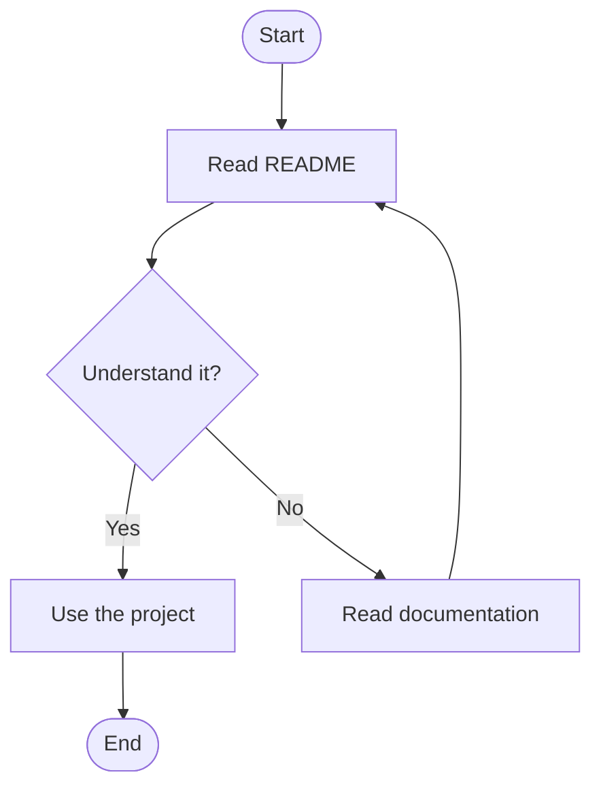

# loca_validation

```mermaid
flowchart TD
    A([Start]) --> B[Read README]
    B --> C{Understand it?}
    C -- Yes --> D[Use the project]
    C -- No --> E[Read documentation]
    E --> B
    D --> F([End])
```
