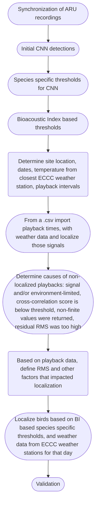

# loca_validation

```mermaid
flowchart TD
    A([Synchronization of ARU recordings]) --> B([Initial CNN detections])
    B --> C([Species specific thresholds for CNN])
    C --> D([Bioacoustic Index based thresholds])
    D --> E(Determine site location, dates, temperature from closest ECCC weather station, playback intervals)
    E --> F([From a .csv import playback times, with weather data and localize those signals])
    F --> G([Determine causes of non-localized playbacks: signal and/or environment-limited, cross-correlation score is below threshold, non-finite values were returned, residual RMS was too high])
    G --> H(Based on playback data, define RMS and other factors that impacted localization)
    H --> I([Localize birds based on BI based species specific thresholds, and weather data from ECCC weather stations for that day]) 
    I --> J([Validation])
```
